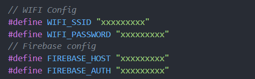
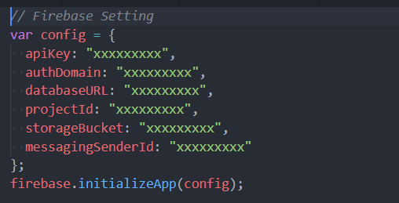
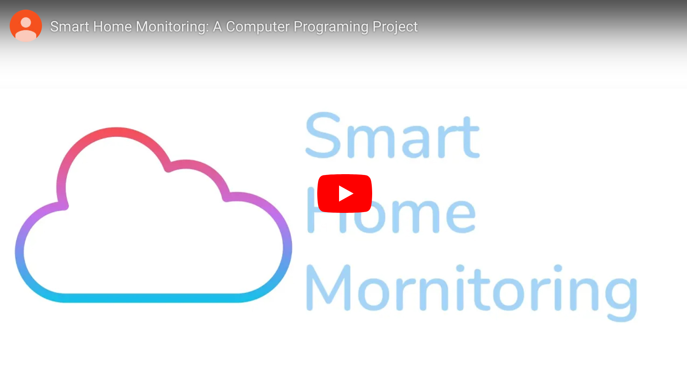
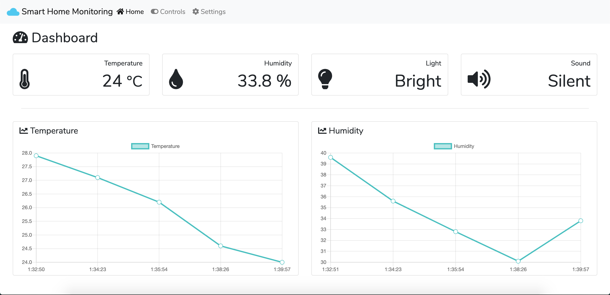
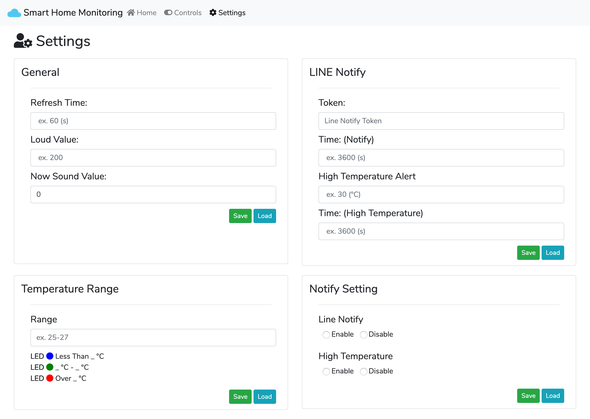
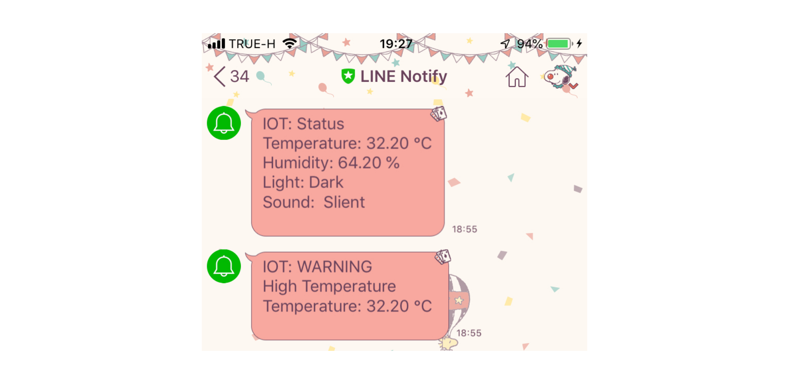
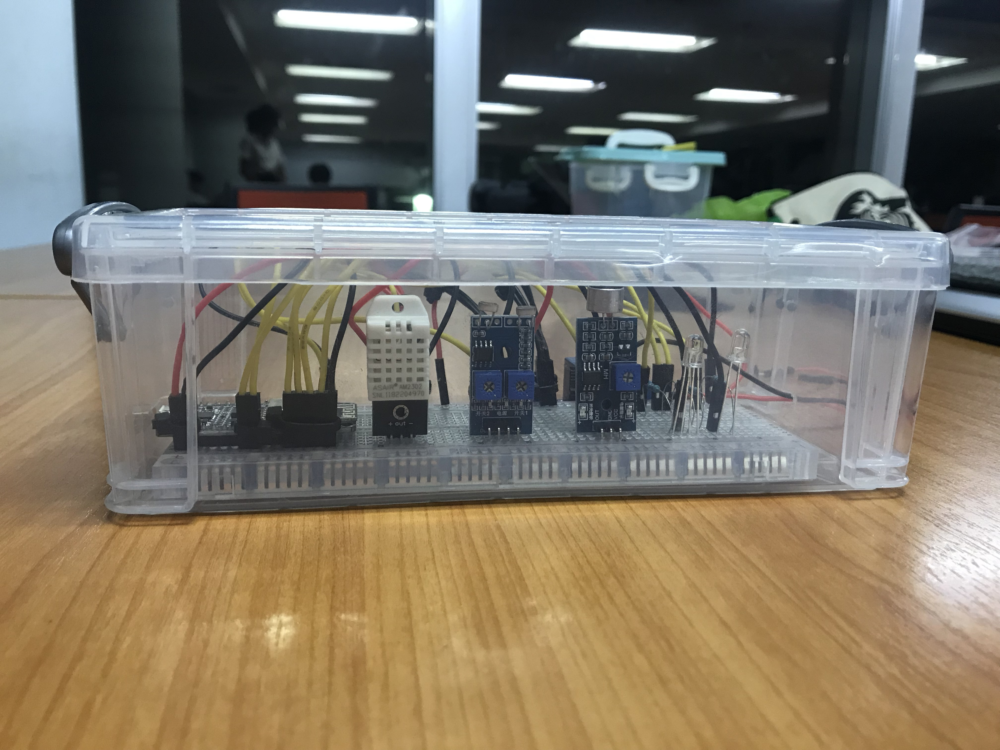

This repository consists of codes of "Computer Programming (Com-Pro)" Project, Faculty of Information Technology, King Mongkut's Institute of Technology Ladkrabang (KMITL).
### Demo Website : https://max180643.github.io/Smart-Home-Monitoring
_____
# Abstract
&nbsp;&nbsp;&nbsp;&nbsp;&nbsp;&nbsp;&nbsp; ในปัจจุบันนี้ วิถีชีวิตของคนไทยมีการปรับตัวเป็นที่สังคมเร่งรีบ เวลาเป็นสิ่งที่สำคัญมาก เจ้าของบ้านหรือห้องพัก อาจไม่มีเวลาอยู่ภายในเคหะสถานตลอดเวลา ทำให้ไม่ทราบถึงสภาพแวดล้อมภายในบ้านหรือที่อยู่อาศัย ณ ปัจจุบัน ทางเราเห็นปัญหานี จึงได้จัดทำโปรเจค “Smart Home Monitoring” นี้ขึ้น เพื่อที่จะได้ทราบถึงสถาพแวดล้อมภายในบ้าน เช่น อุณหภูมิ, ความชื้น ฯลฯ ได้อย่างสะดวกสบาย โดยใช้ Microcontroller และ Modules ในการตรวจสอบสภาพแวดล้อม และแจ้งสถานะมายัง Smart phone ทั้งนี้ เพื่อนำความรู้ที่ได้จากการศึกษา มาใช้ให้เกิดประโยชน์สูงสุด
______
# Objective
* เพื่อตรวจสอบสภาพแวดล้อมภายในบ้าน จากที่ไหนก็ได้ผ่านทางโทรศัพท์มือถือ หรือ อุปกรณ์ที่สามารถเข้าเว็บได้ (Webbased)
* ทำให้ผู้ใช้รับรู้ถึงสภาพแวดล้อมภายในบ้าน และพิจารณาว่าควรจัดการกับสิ่งของบ้านอย่าง
______
# Settings
* ตั้งค่า WiFi โดยการใส่ SSID และ PASSWORD ไว้ในไฟล์ NodeMCU.ino และอัพโหลดขึ้นบอร์ด
* ตั้งค่า Firebase โดยการใส่ FIREBASE_HOST และ FIREBASE_AUTH ไว้ในไฟล์  NodeMCU.ino และทำการอัพโหลดขึ้นบอร์ดเช่นเดียวกัน 

* ทำการใส่ Config ของ firebase ลงไปในไฟล์ firebase.js

______
# Presentation Video

Link : https://youtu.be/uX0R2yFPidw
______
# Features
* Dashboard แสดงผลค่าสถานะต่างๆ ที่ตรวจสอบได้
* Real Time Graph แสดงค่าสถานะของอุณหภูมิ & ความชื้น

* Settings สามารถปรับเปลี่ยนค่าต่างๆ รวมทั้งการแสดงผลแบบ Real time หรือ ตามที่ต้องการก็ได้

* Line Notify แจ้งเตือนสถานะต่างๆ โดยไม่ต้องเข้าเว็บไซด์

______
# NodeMCU
|||
|:-----:|:-----:|
|Unpowered|Powered|
______
# Team Member
|||||
|:-----:|:-----:|:-----:|:-----:|
|[hashtagSELFIE](https://github.com/hashtagSELFIE)|[chattida](https://github.com/chattida)|[max180643](https://github.com/max180643)|[napatkrup](https://github.com/NAPATKRUP)|
#### รายชื่อสมาชิก
- นาย เจษฎาพร ไตรวินิจศรีสุข 61070028
- นางสาว ฉัตรธิดา แจ้งใจ 61070029
- นาย ชาญวิทย์ เศรษฐวงศ์สิน 61070040
- นาย ณภัทร อารยวัฒนาพงษ์ 61070045
